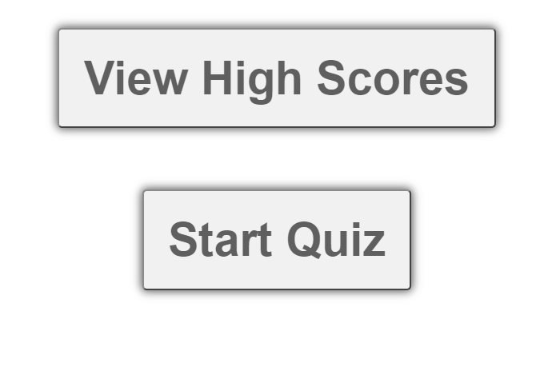

# JS Quiz
Link to page -->
https://rodney1100.github.io/week4challenge/

When the start button is clicked, a timer starts and you will be presented with a question.

When a question is answered, there will be another question to follow it.
Ii a question is answered incorrectly, time is subtracted from the clock. 

The quiz will end when either all questions are answered or the time runs out. 
When the game is over, you will get the chance to save your initials and score.
